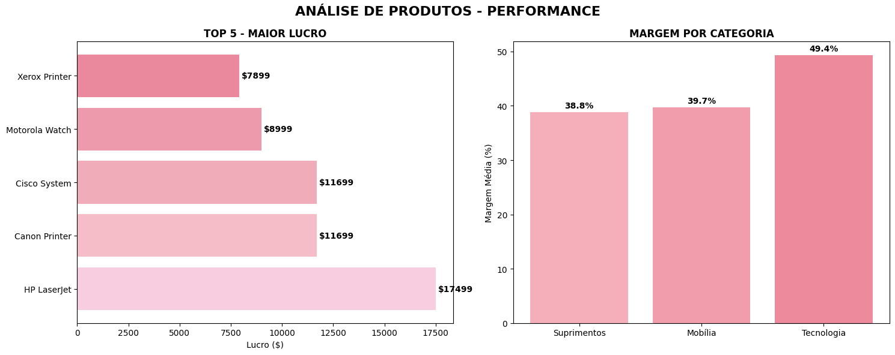
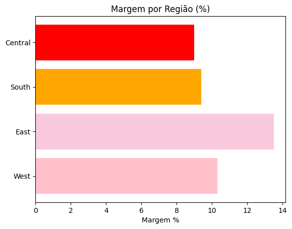

# superstore-analysis
Análise de Rentabilidade da Superstore
# 📊 Análise Superstore

## 🔗 Links Importantes
- **📊 Dashboard Interativo**: [Acesse aqui](https://lookerstudio.google.com/s/k6l25IZi8wg)
- **📓 Análise no Colab**: [Ver notebooks](https://colab.research.google.com/drive/15xdO-jte9LtkUUr6y0XGR02phi3hVGvS?usp=sharing)

## 🖼️ Visualizações

## 📈 Principais Resultados
- **🏆 Melhor produto**: Canon Printer
- **🌍 Melhor região**: East  
- **💰 Maior margem**: Tecnologia (49%)
- **📈 Crescimento**: 15% no ano

